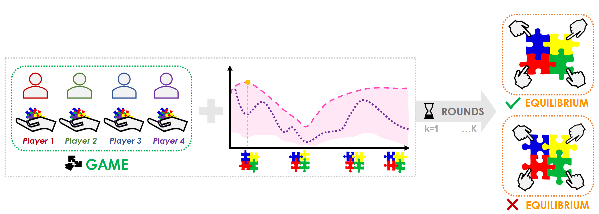

# gameopt :game_die: 


This repository contains the code associated with the paper:

> Optimistic Games for Combinatorial Bayesian Optimization with Application to Protein Design
> 
>  by [Melis Ilayda Bal](https://melisilaydabal.github.io/), [Pier Giuseppe Sessa](https://sessap.github.io/), [Mojmir Mutny](https://mojmirmutny.github.io/), [Andreas Krause](https://las.inf.ethz.ch/), ICLR 2025.
> 
[](https://arxiv.org/abs/2409.18582)

## :pushpin: TL;DR:



GameOpt reformulates combinatorial Bayesian optimization as a cooperative game, where solutions are game equilibria of an optimistic acquisition function. By decomposing large combinatorial domains into individual decision sets, GameOpt scales to problems with exponentially large search spaces and rapidly discovers high-quality protein variants.

## :brain: Abstract 

Bayesian optimization (BO) is a powerful framework to optimize black-box expensive-to-evaluate functions via sequential interactions. In several important problems (e.g. drug discovery, circuit design, neural architecture search, etc.), though, such functions are defined over large *combinatorial and unstructured* spaces. This makes existing BO algorithms not feasible due to the intractable maximization of the acquisition function over these domains. To address this issue, we propose **GameOpt**, a novel game-theoretical approach to combinatorial BO. GameOpt establishes a cooperative game between the different optimization variables, and selects points that are game *equilibria* of an upper confidence bound acquisition function. These are stable configurations from which no variable has an incentive to deviate- analog to local optima in continuous domains. Crucially, this allows us to efficiently break down the complexity of the combinatorial domain into individual decision sets, making GameOpt scalable to large combinatorial spaces. We demonstrate the application of GameOpt to the challenging *protein design* problem and validate its performance on four real-world protein datasets. Each protein can take up to 20^X possible configurations, where X is the length of a protein, making standard BO methods infeasible. Instead, our approach iteratively selects informative protein configurations and very quickly discovers highly active protein variants compared to other baselines.

---

## ⚙️ Project Details

Coming soon!


---

## License

This project is licensed under the MIT License. See the LICENSE file for more details.

---

## :open_book: Citation

If you use this code in your research, please cite our paper:

```bibtex
@article{bal_gameopt,
      title={Optimistic Games for Combinatorial Bayesian Optimization with Application to Protein Design},
      author={Melis Ilayda Bal, Pier Giuseppe Sessa, Mojmir Mutny, Andreas Krause},
      year={2025},
      journal={International Conference on Learning Representations (ICLR)},
}
```
---

This repository will be updated shortly. Thank you for your interest!
